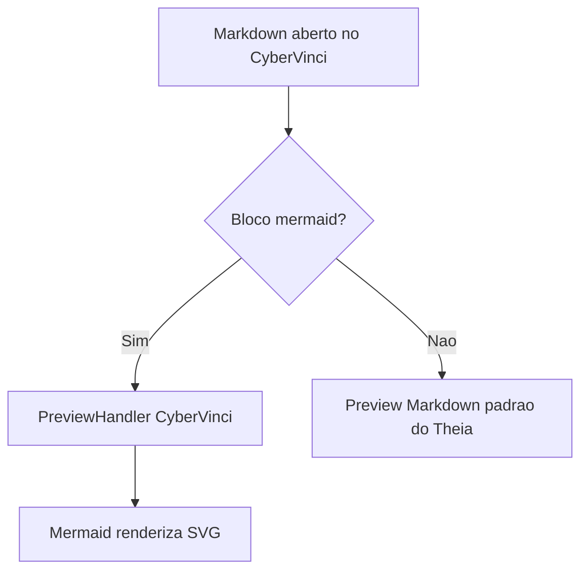
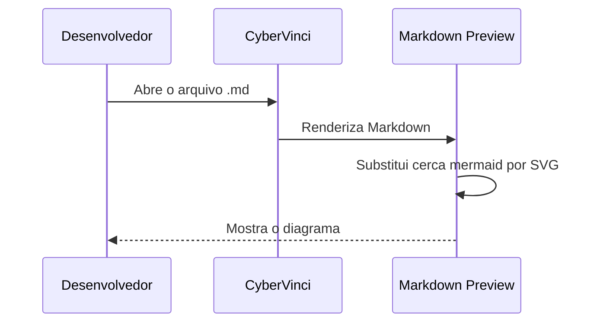

# Mermaid Preview Demo

Este arquivo testa a extensao desacoplada `@cybervinci/markdown-mermaid-preview`.

## Flowchart

## Sequence

## Conteudo normal

O texto comum continua sendo renderizado pelo preview Markdown original do Theia.
